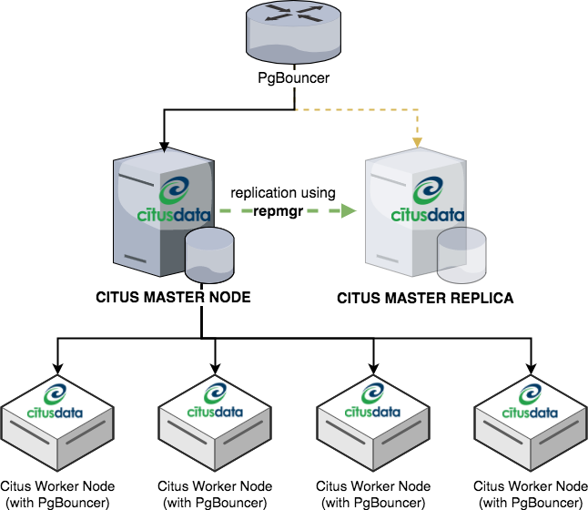

# Ansible Playbook for Citus (with repmgr and pgbouncer)

## Overview
This ansible playbook will provisioning Postgres and Citus Extension to Master & Worker nodes (**CentOS only**). It also create Citus Master Replica by using `repmgr`. On top of these master, it has `pgbouncer` to identify which master is currently active. You can see diagram below.



## How to run
1. `$ cp hosts.example hosts`
2. `$ cp ansible-extra-vars.yaml.example ansible-extra-vars.yaml`
3. Define your master, replica and worker  in `hosts` file. This must be *public ip* or host name, so your machine can `ssh` to installed machine
4. Define ansible extra variable in `ansible-extra-vars.yaml`. This must be *private ip*, so master will communicate to its worker internally.
5. Run `ansible-playbook citus-playbook.yaml --extra-vars "@ansible-extra-vars.yaml""`

Remark: Feel free to contribute.

## Notes
- Currently, this playbook only support `CentOS 7`
- Any node in `(10.0.0.0/8)` subnet is able to connect to PostgreSQL without authentication. This can be avoid after [this citus's issue](https://github.com/citusdata/citus/issues/1822) is fixed.
- User created by this playbook is `SUPERUSER`
 
## How to Update Citus version

You can update citus version by running ansible-playbook below. Please note that it require database restarted.

### Update Patch Version
```
ansible-playbook citus-patch-upgrade.yaml --extra-vars "@ansible-extra-vars.yaml"
```

### Update Minor Version
```
ansible-playbook citus-minor-upgrade.yaml --extra-vars "@ansible-extra-vars.yaml"
```

Reference: https://docs.citusdata.com/en/v7.1/admin_guide/upgrading_citus.html#major-and-minor-version-upgrades


## TODO
